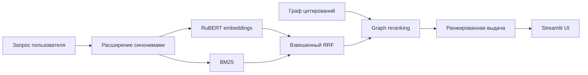

<div align="center">
  

  # Patent RAG

  **Интеллектуальный поиск по российским патентам: семантика, BM25 и граф цитирований**

  [](https://www.python.org/)
  [](https://streamlit.io/)
  [](https://qdrant.tech/)
  [](#как-это-работает)
</div>

Patent RAG — прототип поискового слоя для RAG-системы по документам Роспатента. Он объединяет смысловую близость текста, полнотекстовый поиск и связи между патентами, чтобы находить релевантные документы даже тогда, когда формулировки запроса и патента не совпадают дословно.

> Сейчас реализован **retrieval-слой**: поиск и ранжирование документов. Генерация ответа по найденному контексту — следующий этап проекта.

## Возможности

- семантический поиск на русскоязычной модели RuBERT;
- полнотекстовое ранжирование BM25;
- объединение выдачи через взвешенный Reciprocal Rank Fusion;
- усиление результатов с помощью графа цитирований из поля 56;
- расширение отраслевых запросов словарём синонимов;
- поиск похожих документов по номеру патента;
- интерактивный интерфейс на Streamlit;
- локальное хранение в Qdrant без отдельного сервера.

## Как это работает



Поисковый конвейер подробно описан в [архитектурной документации](docs/architecture.md).

## Быстрый старт

### 1. Установите зависимости

Требуется Python 3.10 или новее.

```bash
git clone <repository-url>
cd patent-rag
python -m venv .venv
```

Активация окружения:

```powershell
# Windows PowerShell
.venv\Scripts\Activate.ps1
```

```bash
# Linux / macOS
source .venv/bin/activate
```

```bash
python -m pip install --upgrade pip
pip install -r requirements.txt
```

### 2. Подготовьте индекс

Разместите локальный snapshot Qdrant в каталоге:

```text
data/qdrant_local_db/
```

В snapshot должна быть коллекция `patents_ru` с векторами размерности 768 и payload-полями `number`, `title`, `abstract`, `publication_date` и `citations`. Подробности — в [инструкции по данным](data/README.md).

### 3. Запустите приложение

```bash
streamlit run app.py
```

При первом запуске `sentence-transformers` загрузит модель `DeepPavlov/rubert-base-cased-sentence`.

## Режимы поиска

| Режим | Что делает |
|---|---|
| По запросу | Параллельно запускает векторный поиск и BM25, объединяет ранги и учитывает цитирования |
| Похожие по номеру | Берёт embedding известного патента и ранжирует соседние документы с учётом графовых связей |

В интерфейсе можно менять число результатов, баланс между векторным поиском и BM25, а также включать или отключать граф цитирований.

## Структура репозитория

```text
patent-rag/
├── data/
│   └── README.md             # контракт и размещение локального индекса
├── docs/
│   └── architecture.md       # устройство поискового конвейера
│   
├── src/
│   └── patent_rag/
│       ├── __init__.py
│       └── engine.py         # поиск, RRF и графовый reranking
├── app.py                    # точка входа Streamlit
├── CONTRIBUTING.md
├── requirements.txt
└── README.md
```

Локальная база, веса, выгрузки и рабочая копия парсера не входят в Git: это сохраняет репозиторий компактным и не смешивает код с данными.

## Конфигурация

Параметры можно передать через переменные окружения:

| Переменная | Значение по умолчанию | Назначение |
|---|---|---|
| `PATENT_RAG_QDRANT_PATH` | `data/qdrant_local_db` | путь к локальному snapshot Qdrant |
| `PATENT_RAG_COLLECTION` | `patents_ru` | имя коллекции |
| `PATENT_RAG_MODEL` | `DeepPavlov/rubert-base-cased-sentence` | модель эмбеддингов |

Пример для PowerShell:

```powershell
$env:PATENT_RAG_QDRANT_PATH = "D:\patent-data\qdrant_local_db"
streamlit run app.py
```

## Технологии

- [Streamlit](https://streamlit.io/) — пользовательский интерфейс;
- [Sentence Transformers](https://www.sbert.net/) и RuBERT — векторные представления;
- [Qdrant](https://qdrant.tech/) — локальный векторный индекс;
- [rank-bm25](https://github.com/dorianbrown/rank_bm25) — лексическое ранжирование;
- [NetworkX](https://networkx.org/) — граф цитирований.

## Ограничения и roadmap

- [ ] воспроизводимый ETL-конвейер из выгрузки ФИПС в Qdrant;
- [ ] генерация ответа по найденным патентам со ссылками на источники;
- [ ] фильтры по дате, МПК/СПК, заявителю и статусу;
- [ ] оценка качества на размеченном наборе запросов;
- [ ] тесты поискового и графового ранжирования;
- [ ] контейнеризация и серверный режим Qdrant.

Если хотите предложить улучшение, откройте issue или прочитайте (CONTRIBUTING.md).
